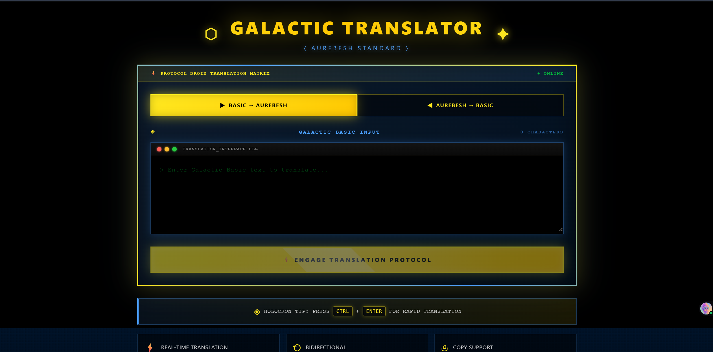

# 🌌 Galactic Translator

A full-stack web application that translates English text to Aurebesh (Star Wars Galactic Basic) and vice versa. Experience an immersive Star Wars-themed interface with animated starfields, terminal-style UI, and authentic protocol droid aesthetics.


## ✨ Features

### Core Functionality
- **Full Stack Architecture**: React frontend with Node.js/Express backend
- **Bidirectional Translation**: English (Galactic Basic) ↔ Aurebesh conversion
- **Real-time Translation**: Instant conversion with loading states
- **Copy to Clipboard**: One-click data transmission functionality
- **Keyboard Shortcuts**: Ctrl+Enter for rapid translation

### Immersive UI/UX
- **Star Wars Intro**: "A long time ago..." opening animation
- **Animated Starfield**: Moving stars and twinkling background effects
- **Terminal Interface**: macOS-style terminal windows with colored status dots
- **Protocol Droid Status Bar**: Live translation matrix status indicator
- **Empire & Rebel Logos**: Glowing symbolic elements
- **Aurebesh Font Rendering**: Authentic Star Wars typography with glow effects
- **Matrix-Style Terminal**: Green command-line text with terminal prompts
- **Gradient Animations**: Shifting yellow gradient logo effects
- **Hover & Pulse Effects**: Interactive glowing buttons and borders
- **Character Counter**: Real-time input character tracking
- **Holocron Tips**: Star Wars-styled information sections
- **Responsive Design**: Seamless experience on all devices

## 🚀 Tech Stack

### Frontend
- React 18
- Vite
- Tailwind CSS
- Custom Aurebesh font

### Backend
- Node.js
- Express
- CORS enabled

## 📋 Prerequisites

- Node.js (v14 or higher)
- npm or yarn

## 🛠️ Installation & Setup

### 1. Install Backend Dependencies

```powershell
cd backend
npm install
```

### 2. Install Frontend Dependencies

```powershell
cd frontend
npm install
```

## 🎮 Running the Application

You need to run both the backend and frontend servers.

### Start Backend Server (Terminal 1)

```powershell
cd backend
npm start
```

The backend API will run on `http://localhost:3001`

### Start Frontend Server (Terminal 2)

```powershell
cd frontend
npm run dev
```

The frontend will run on `http://localhost:3000`

Open your browser and navigate to `http://localhost:3000`

## 🎯 API Endpoints

### POST /translate
Translates English text to Aurebesh

**Request:**
```json
{
  "text": "Hello World"
}
```

**Response:**
```json
{
  "translated": "Herf-Esk-Leth-Leth-Osk Wesk-Osk-Resh-Leth-Dorn"
}
```

### POST /reverse
Translates Aurebesh back to English

**Request:**
```json
{
  "text": "Aurek-Usk-Resh-Esk-Besh-Esk-Senth-Herf"
}
```

**Response:**
```json
{
  "translated": "AUREBESH"
}
```

### GET /health
Health check endpoint

## 🔤 Aurebesh Character Map

| Letter | Aurebesh Name |
|--------|---------------|
| A      | Aurek         |
| B      | Besh          |
| C      | Cresh         |
| D      | Dorn          |
| E      | Esk           |
| F      | Forn          |
| G      | Grek          |
| H      | Herf          |
| I      | Isk           |
| J      | Jenth         |
| K      | Krill         |
| L      | Leth          |
| M      | Mern          |
| N      | Nern          |
| O      | Osk           |
| P      | Peth          |
| Q      | Qek           |
| R      | Resh          |
| S      | Senth         |
| T      | Trill         |
| U      | Usk           |
| V      | Vev           |
| W      | Wesk          |
| X      | Xesh          |
| Y      | Yirt          |
| Z      | Zerek         |

## 📸 Screenshots



*The immersive Star Wars-themed translation interface with animated starfield, terminal windows, and protocol droid aesthetics*

## 🎨 Visual Design

### Color Palette
- **Star Wars Yellow**: `#FFE81F` - Primary UI elements, buttons, logos
- **Imperial Blue**: `#4A90E2` - Labels, secondary elements, terminal accents
- **Matrix Green**: `#00FF41` - Terminal text, command prompts
- **Deep Space**: Gradient from `#000814` to `#001d3d` - Background

### UI Elements
- **Animated Starfield**: CSS-based moving stars with twinkling effects
- **Terminal Windows**: Black background with colored status dots (red, yellow, green)
- **Gradient Borders**: Animated yellow-to-blue border glow on main card
- **Glowing Effects**: Text shadows and box shadows for depth
- **Monospace Typography**: Courier New for authentic terminal feel
- **Aurebesh Display**: Custom font with yellow glow for translations

## 🎨 Customization

### Modify Colors
Edit `frontend/src/App.css` to customize the theme:

```css
/* Main colors */
--star-wars-yellow: #FFE81F;
--imperial-blue: #4a9eff;
--matrix-green: #00ff41;
```

### Adjust Animations
Control animation speeds in `App.css`:


## 🚀 Future Enhancements

Potential features to add:
- [ ] Sound effects (lightsaber, droid beeps)
- [ ] Voice input translation
- [ ] Save translation history
- [ ] Share translations as images
- [ ] Multiple Star Wars language support (Huttese, Mandalorian)
- [ ] Dark/Light side theme toggle
- [ ] Export to PDF with Aurebesh font
- [ ] Mobile app version
- [ ] API rate limiting and authentication

## 📝 License

MIT License - Feel free to use this project for learning or personal use.

## 👨‍💻 Author

Created with ❤️ for Star Wars fans and developers

## 🌟 May the Force Be With You!

Enjoy translating to the language of a galaxy far, far away! 

*"This is the way."* 🚀⭐

---

### Project Structure
```
Galactic Translator/
├── backend/
│   ├── server.js          # Express API with translation logic
│   ├── package.json
│   └── node_modules/
├── frontend/
│   ├── src/
│   │   ├── App.jsx        # Main React component
│   │   ├── App.css        # Star Wars themed styles
│   │   ├── main.jsx       # React entry point
│   │   └── index.css      # Global styles
│   ├── index.html         # HTML template
│   ├── package.json
│   ├── vite.config.js     # Vite configuration
│   ├── tailwind.config.js # Tailwind CSS config
│   └── node_modules/
└── README.md              # This file
```
